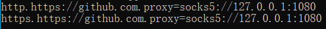

一直苦恼于git clone 的速度奇慢，网上的教程修改host文件后成功的连接不上github ，万般苦恼。

还有一种解决方案是利用码云加速，但是实际操作起来其实略微麻烦，总是比不过一个git clone 解决一切来的方便。

最后在大神的点破下，说是dns污染（虽然并不知道什么是dns污染），所以，只能采用走代理的方式来加速我的github速度。

---

 ### 前提条件

首先，你必须要有一个让你探索神秘世界的天梯，可以google，不懂的话请自行百度。因为使用全局模式的时候git的默认设置其实并不会走代理，而是需要自己进行全局配置后才可以，具体步骤见下。

---

### 步骤

将下面的代码复制到控制台，并且将最后的面1080端口改成自己的代理端口，一般来说都是默认的1080

```shell
# 修改http协议，默认1080端口
git config --global http.https://github.com.proxy https://127.0.0.1:1080
git config --global https.https://github.com.proxy https://127.0.0.1:1080

# 修改socks5协议，默认采用1080端口
git config --global http.https://github.com.proxy socks5://127.0.0.1:1080
git config --global https.https://github.com.proxy socks5://127.0.0.1:1080

//若出现404错误，请尝试下面这个
git config --global https.proxy http://127.0.0.1:1080
git config --global https.proxy https://127.0.0.1:1080

```

按照上面的配置后，可以使用下面这个命令来查看是否配置成功。

```shell
git config -l
```

如果出现这两行字样，就是配置成功，在试一下git clone，速度起飞。




---

### 取消设置

如果想要取消设置，输入下面两行命令行即可

```shell
#取消前面的代理设置
git config --global --unset http.proxy
git config --global --unset https.proxy
```

