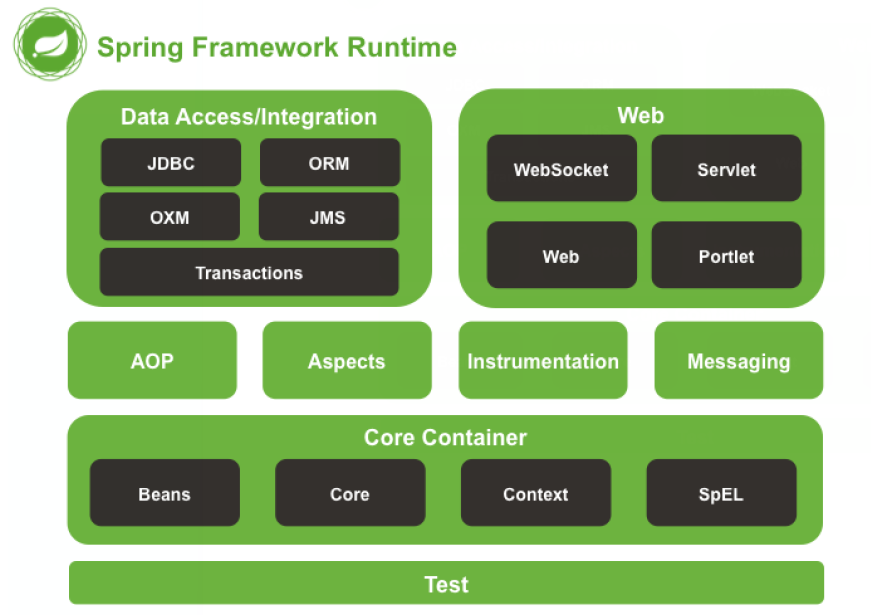

## 引言

​	由于学习工作需要，开始学习一些Spring的用法，这是系列笔记的第一篇，希望以后由时间不断的补充，把自己的学习笔记补充完整！！

​	（先立flage，反正就是用来打破的。。。。。。）

​	刚入门，有些东西还不是很了解，有错误请指教，欢迎纠错！！

------

## 一、基础知识

* Spring概述

     * Spring是一个轻量级的开发框架，旨在提高开发人员的工作效率以及提高系统的可维护性。

     * Spring 的优势

       * 方便程序之间解耦，简化开发

         通过Spring 的ioc容器，可以将对象之间的依赖关系交由Spring 控制，避免程序之间的过度耦合，使得用户之间可以更加专注于上层的应用开发

       * AOP编程支持

         面向切面，通过注解或者配置文件，能更好的简化切面编程的步骤s

       * 声明式事务支持

         通过声明的方式灵活的将食物进行管理
         

* Spring的体系结构s

  

其中各部分模块大致如下所示：

**Test**：提供了对Junit和TestNG的测试使用；

**Beans和Core**：这是整个Spring 的基础部分，包括了控制反转和依赖注入，通过一个工厂模式对象实例化，而bean则是一个个被实例化并且被IOC容器锁管理的对象，可以通过注解或者xml配置文件实现bean 的装配和注入；

**Context**：建立于Beans和Core基础之上，用于注解开发，可以理解为一个资源管理和配置的中心

**AOP**：面向切面编程，提供了一些规范的编程实现，用户可以动态的添加到自己所需的代码中

------

## 二、常见的类的解释

* BeanFactory和ApplicationContext

  二者的主要区别在于对于bean的创建时间不一样，BeanFactory是什么时候用什么时候创建对象，随用随创建，适用于多例模式

  但是ApplicationContext是在一加载完配置文件的时候就会把所有的对象都创建，后续需要的时候在取，这种情况下所有的对象都是默认采用单例模式

* ApplicationContext接口的实现类

  * ClassPathXmlApplicationContext 

    直接从类的根路径下加载配置文件，传入的参数就是本地的配置文件名称

  * FileSystemXmlApplicationContext

    磁盘路径加载配置文件，需要传入配置文件的绝对路径

  * AnnotationConfigAoolicationContext

    使用注解配置容器时，需要用这个类来创建IOC容器，传入的是一个写好的配置类

```java
//使用ClassPathXmlApplicationContext  传入的是在类目录下的配置文件
ApplicationContext context = new ClassPathXmlApplicationContext("bean.xml");
//FileSystemXmlApplicationContext 传入的是一个绝对路径
ApplicationContext context = new new FileSystemXmlApplicationContext(“D:/Spring/.../bean.xml”);
```

**前期一般是会使用xml配置的方式完成信息的注入， 所以前面两种方式，特别是第一种ClassPath 的方式会用的更多，而注解的方式，只有当全部使用注解类的时候才会使用 前期了解就好了**


下面是使用注解的方式

```java
//首先要定义一个配置类，用注解说明，具体的注解在下文做解释
//申明这是一个配置类
@Configuration	
//注解定义扫描的包
@ComponentScan(basePackages = {"day02.demo2"})
//加载的本地properties文件
@PropertySource("classpath:JDBCConfig.properties")
public class SpringConfiguration {

    @Value("${jdbc.driver}")
    private String driver;
    @Value("${jdbc.url}")
    private String url;
    @Value("${jdbc.username}")
    private String userName;
    @Value("${jdbc.password}")
    private String password;

    /**
     * 创建一个runner对象
     * bean 的作用就是把当前的方法返回值作为bean对象存储到springioc容器中
     * name：指定bean 的id，不备注的时候，默认是当前方法名名称
     * 使用注解配置方法时，他如果有参数传入，就会自动取spring容器中找到对应的参数
     * 如果找不到 就会报错
     * @param dataSource
     * @return
     */
    @Bean(name = "runner")
    public QueryRunner createQuerrtRunner(DataSource dataSource) {
        return new QueryRunner(dataSource);
    }

    /**
     * 
     * @return
     */
    @Bean(name = "dataSource")
    @Scope("prototype")
    public DataSource createDataSource() {
        ComboPooledDataSource dataSource = new ComboPooledDataSource();
        try {
            dataSource.setDriverClass(driver);
            dataSource.setJdbcUrl(url);
            dataSource.setUser(userName);
            dataSource.setPassword(password);
        } catch (PropertyVetoException e) {
            e.printStackTrace();
        }
        return dataSource;
    }
```

在有上面的完整的一个配置类后，就可以直接用AnnotationConfigAoolicationContext 来获取到context

```java	
ApplicationContext context = new AnnotationConfigAoolicationContext(SpringConfiguration,class);
```

------

## 三、XML文件的标签用法

xml文件主要完成的功能就是对象的注入，以及对象属性的配置，下面就简单的记录一下常用的标签对象的用法

### 1、bean标签

```xml
<!-- bean标签的作用就是完成对象的注入，把一个对象交给Spring容器进行管理，默认情况下调用的是无参构造函数，如果没有无参构造函数则不能创建成功-->
<!-- 一些标签的解释
	1、id:对象的id ，可以理解为是全局唯一标识号，通过这个id可以确定为对象注入的对象
	2、class：这个指定类的全名，即类路径
通过上面着两个方法之后Spring就会自动为我们创建好一个你所需要的bean对象
	除了上面两个基本属性外，还有下面几种属性
	3、socpe：指定对象的作用范围，具体有以下几种情况
		singleton：默认，单例模式，对象只会存在一个实例
		prototype：多例模式，可以多个不同的对象，一般与bennFactory一起使用
		request：常用于Web项目中，讲这个bean对象存入到request域中
		session：同上，只是存在于session域中
		global session： web项目中，一般用于分布式环境，可以是的多台服务器一起访问到这个session中，如果只是在单机环境下，效果和session一致
	4、init-method： 指定初始化方法，没有写该标签时采用的时默认的无参构造方法
	5、destory-method：指定类的销毁方法，一旦一个类被销毁就会执行这个方法

除此之外，对于某些了类的内部还需要引用别的对象，可以在bean标签的内部引入，如下面的代码示例中，引入的一个accountDao的对象，该对象同样需要在xml中以bean的形式申明
！！！！！！！！！！！！！！！！！！！！！！！！！！
其中name是指对象中的变量名，即要注入对象的变量名称，ref指的时对那个bean的引用，这里的值是bean中的id 这个需要区分
！！！！！！！！！！！！！！！！！！！！！！！！！！
-->

<!--配置了一个service 对象-->
<bean id="accountService" class="day02.demo2.service.impl.AccountServiceImpl" scope="prototype">
            <property name="accountDao" ref="accountDao"/>
        </bean>

<!--配置了一个dao 对象-->
 <bean id="accountDao" class="day02.demo2.dao.impl.AccountDaoImpl"/>
```

上面的bean中展示的是一个无参构造函数，有参的构造函数则需要手动将参数传入，下面举例说明

```java
//演示类
public class Test() {
    
   private String name;
   private int age;
    //自定义的一个类
   private Car car;
    
   public Test(String name, int age) {
       this.name = name;
       this.age = age;
   }
    public Test(Car car) {
        this.car = car;
    }
}
```

上面的类需要仅有一个有参构造函数，下面演示一下标签的配置

```xml
<!--有参构造函数的用法
	这里需要用到一个constructor-arg 的属性，含义就是指定参数构造的内容
	字段含义如下
	name：参数名称，Spring会自动寻找对应名字的参数进行注入
	type：参数类型，可以省略
-->
<bean id="test" class="demo.Test">
    <constructor-arg name="name" type="java.long.String">
        <value>someone</value>
    </constructor-arg>
    <constructor-arg name="age" type="java.long.int">
        <value>12</value>
    </constructor-arg>
</bean>


<!--如果参数是一个自定义的类型，那么这个类型必须也是在bean中注册的，才可以被识别到
	这里用到的是ref的标签
 具体的标签写法如下
-->

<!--首先配置一个引用对象-->
<bean id="car" class="demo.car"/>
<!--具体配置 
	这里调用了一个ref 的属性，ref 的名称则是你需要引入的bean 的id
-->
<bean id="test" class="demo.test">
    <constructor-age name="car" ref="car"/>
</bean>
```

通过以上的步骤，至此大致可以完成一个bean 的标签配置了，基本可以满足日常使用。然后通过前文提到的ApplicationContext接口提供的getbean()方法就可以从容器中获取到对象

```java
ApplicationContext context = ClassPathXmlApplicationContext();
//这里传入的参数是要获取的对象的id名称
AccountService service = context.getben("accountService");
//到这里就已经获取到了一个所需要的accountsevice对象
```

**！！！！！！！！！！**

<font clolor= Red>**需要注意的是，当一个类中有一个对象需要通过xml注入的时候，在类中必须为该对象提供get方法**</font>


### 2、Bean的实例化

一般情况下，为了尽可能的解耦，把对象的创建过程分割开来，常常会用工厂模式来进行实例化，对于一个bean 的实例化，大致上也可以分为2种

第一种就是默认的方式，使用无参构造方法，采用上述的bean标签配置之后默认的就是这种方式

第二种：采用工厂模式创建对象，这个模式又可以细分为两种，一种是采用静态的工厂模式，一种是实例化的工厂模式

```java
public class BeanFactory {
    //静态创建方法
    public static Car creatCar() {
        return new Car();
    }
    //非静态方法
    public Cat creatCat() {
        return new Cat();f
    }
}
```

* 静态工厂模式配置

```xml
<!--使用静态工厂配置bean
	id：bean的id
	class： 工厂类的全限定类名
	factory-method：指定对象的静态方法
-->
<bean id="car" class="demo.BeanFactory" factory-method="creatCar">
</bean>
```

* 实例化工厂模式配置

```xml
<!--先要实例化一个工厂对象 然后才能进行配置-->
<bean id="factory" class="demo.BeanFactory">
</bean>

<!--调用实例化工厂-->
<bean id="Cat" factory-bean="factory" factory-method="creatCat"/>
```

**其实静态工厂和实例化工厂的区别仅仅只是在于需不需要配置一个工厂对象而已**


### 3、bean的生命周期

一个bean对象有着他自己的作用范围以及生命周期，要经历创建，使用，销毁三个阶段，而上面讲到bean的标签属性时，讲到一个单例和多例模式，不同的模式下，一个bean 的作用范围和生命周期时不一样的，具体的区别如下

表 bean的作用范围和生命周期

| bean模式 | 含义                                                       | 作用范围       | 创建                                       | 使用                                     | 销毁                                                         |
| :------- | ---------------------------------------------------------- | -------------- | ------------------------------------------ | ---------------------------------------- | ------------------------------------------------------------ |
| 单例模式 | 一个应用只有一个该对象的实例，多次调用时不会重复创建新实例 | 整个应用范围   | 应用加载，创建容器的时候会被创建           | 伴随着容器，只要容器不销毁，就会一直存在 | 当容器销毁的时候，就会被销毁，有容器控制                     |
| 多例模式 | 每当使用这个对象的时候，都会创建一个新的实例               | 某次访问该对象 | 每当使用的时候，创建一个新对象，随用随创建 | 只要对象在使用中，就一直存在             | 不由容器控制，当长时间不使用的时候，会按照java 的回收机制回收 |


### 4、bean的属性赋值

在xml中给bean赋值，需要有以下操作，这里采用的时无参构造函数的注入方法，有参的构造函数可以参考前面的注解

要注意的是，这里采用的都是set方法的注入方式，所以要给每一个属性都添加set方法

```java
import java.util.Date;
import java.util.List;
import java.util.Map;

/**
* 假定一个类 用来模拟复制操作
*/
public class Student {

    private String name;
    private int age;
    private boolean leader;
    private List<String> lesson;
    private Map<String,Integer> gradle;
    private Date admissionTime;

    public void setName(String name) {
        this.name = name;
    }

    public void setAge(int age) {
        this.age = age;
    }

    public void setLeader(boolean leader) {
        this.leader = leader;
    }

    public void setLesson(List<String> lesson) {
        this.lesson = lesson;
    }

    public void setGradle(Map<String, Integer> gradle) {
        this.gradle = gradle;
    }

    public void setAdmissionTime(Date admissionTime) {
        this.admissionTime = admissionTime;
    }
}
```

在创建bean 的时候赋值

```xml
<!--常见类型的属性变量可以直接写变量值，spring会自动帮我们识别
采用的是property标签
	name 代表的是变量名称
	value是对应的值
	由于一些自定义类需要引用，需要先在xml文件中配置好后，才能在赋值的时候用ref引用
	对于集合等引用，在后面进行介绍
--> 
<bean id="student" class="Student">
    	<!--name 的属性变量赋值-->
        <property name="name" value="Myron"/>
        <property name="age" value="18"/>
        <property name="leader" value="false"/>
        <property name="lesson">
            <list>
                <value>语文</value>
                <value>数学</value>
                <value>英语</value>
            </list>
        </property>
        <property name="gradle">
            <props>
                <prop key="语文">90</prop>
                <prop key="英语">60</prop>
                <prop key="数学">90</prop>
            </props>
        </property>
   		<!--由于Date类型不是基本类型，需要使用引用-->
        <property name="admissionTime" ref="now"/>
    </bean>
    
    <bean id="now" class="java.util.Date"/>
```


这里介绍还有一种看起来较为简洁的设置方法，我们称之为p空间引用，需要在xml文件中引入新的配置方法

```xml
<beans xmlns="http://www.springframework.org/schema/beans"
       xmlns:xsi="http://www.w3.org/2001/XMLSchema-instance"
       xmlns:context="http://www.springframework.org/schema/context"
       <!--这里引用P空间引用-->
       xmlns:p="http://www.springframework.org/schema/p"
       xsi:schemaLocation="
            http://www.springframework.org/schema/beans
            http://www.springframework.org/schema/beans/spring-beans-3.0.xsd
            http://www.springframework.org/schema/context
            http://www.springframework.org/schema/context/spring-context-3.0.xsd">
<!--只是赋值的名称由属性值变为了标签值，其他基本一致-->
	<bean id="student" class="Student" p:name="Myron" p:age="18" p:admissionTime-ref="now"/>

    <bean id="now" class="java.util.Date"/>

</beans>
```


### 5、集合类型的注入

```xml
<!--注入的集合可以大致分为两类
	1、集合类 包括普通的数组 int[] List<> Set<>
	2、Map类 map<> entry<> props prop
	
	这里定义几种类型方便应用，并在类中为其设置set get 方法
	private List<String> lesson;
    private Map<String,Integer> gradle;
    private String[] strs;
    private Set<String> sets;
    private Properties properties;
-->
    <bean id="student" class="Student">
        <!--list集合的设置
            其实只要是同一种类型的， array list set标签可以互换
            都是将变量值放在value标签中，系统会自动识别不同的书类型
         -->
        <property name="strs">
            <array>
                <value>AAA</value>
                <value>bbb</value>
            </array>
        </property>
        <property name="lesson">
            <list>
                <value>123</value>
                <value>123</value>
                <value>123</value>
            </list>
        </property>
        <property name="sets">
            <set>
                <value>AAA</value>
                <value>BBB</value>
                <value>CCC</value>
            </set>
        </property>
        <!--map数组注入
            可以看到，这里将map 和prop的属性标签互换后，还是可以成功赋值
            采用的是key属性和value属性的使用
        -->
        <property name="gradle">
            <props>
                <prop key="test">aaa</prop>
                <prop key="test1">bbb</prop>
            </props>
        </property>
        <property name="properties">
            <map>
                <entry key="test1" value="123"></entry>
                <entry key="test2" value="312"></entry>
            </map>
        </property>
    </bean>

```

------

在这篇笔记里面记录了一下常用的通过配置文件的方式来完成一个bean 的注入，以及使用，算是一个Spring 的入门，以后有时间再进行该系列的补充